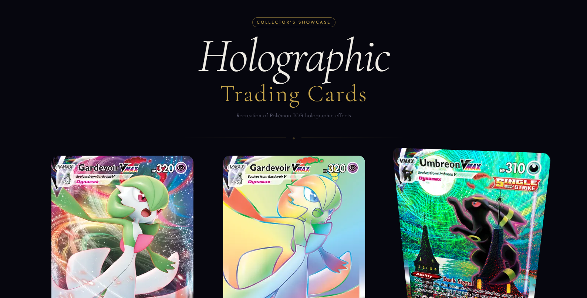

# Card Showcase

A Next.js 16 app for showcasing interactive card UI effects.



## Getting Started

Install dependencies and run the development server:

```bash
pnpm install
pnpm dev
```

Then open [http://localhost:3000](http://localhost:3000).

## Scripts

- `pnpm dev` - Start the development server
- `pnpm build` - Build for production
- `pnpm start` - Start the production server
- `pnpm lint` - Run Biome lint checks
- `pnpm format` - Format code with Biome
